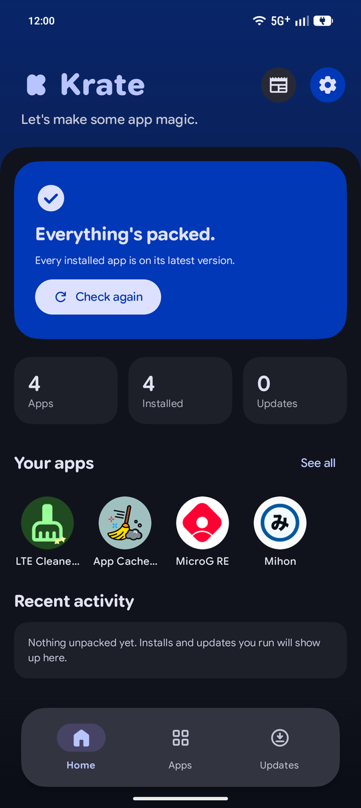
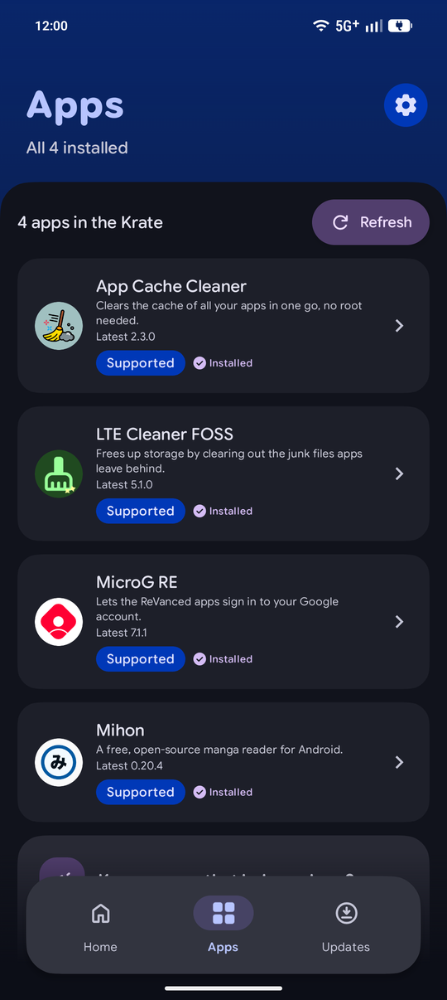
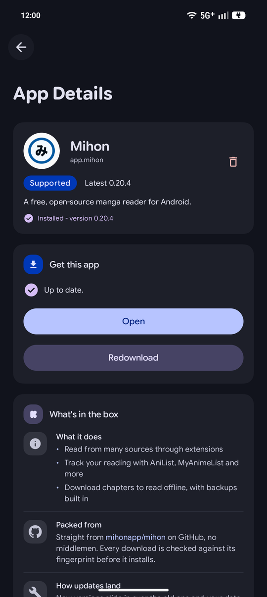
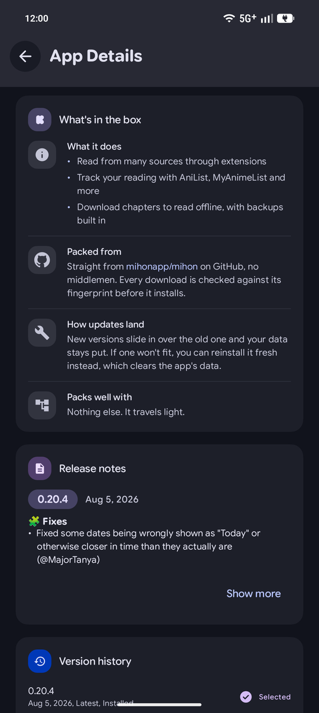
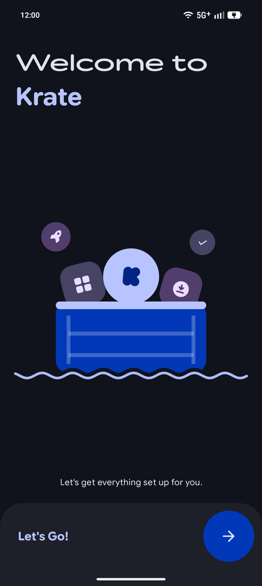
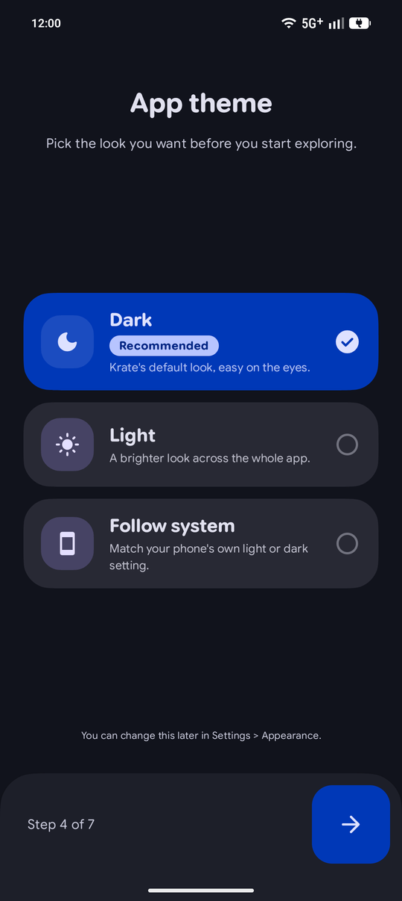
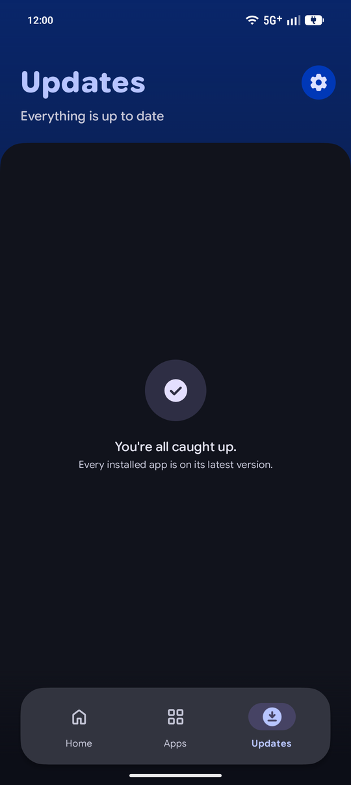
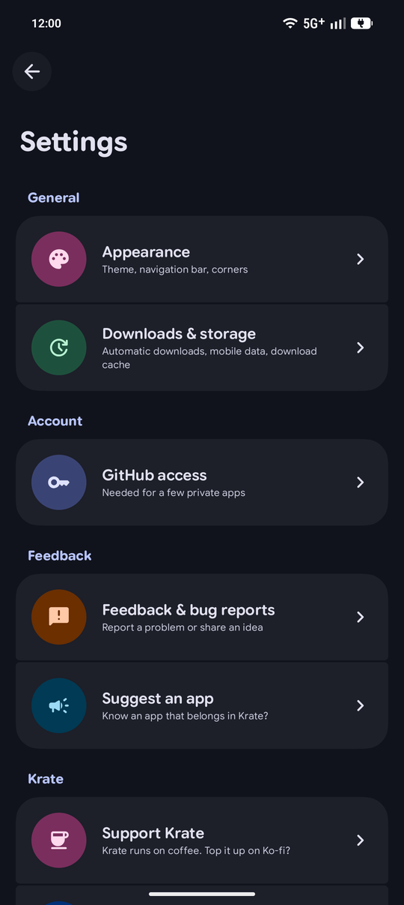

<p align="center">
  
</p>

<h1 align="center">Krate</h1>

<p align="center">
  <b>Your apps, straight from their releases.</b><br>
  <i>No Play Store was harmed in this Krate.</i>
</p>

<p align="center">
  <a href="https://github.com/Cl0ud-9/Krate/releases/latest"></a>
  
  
  
</p>

<p align="center">
  <a href="https://github.com/Cl0ud-9/Krate/releases/latest"></a>
</p>

<p align="center">
  
  
  
  
</p>
<p align="center">
  
  
  
  
</p>

---

## What's in the box

Some of the best Android apps never make it to the Play Store. They live on GitHub, and keeping them up to date means
checking release pages, downloading APKs and hoping you grabbed the right file.

**Krate does that for you.** It keeps a small, hand-picked shelf of apps, checks for new versions in the background,
downloads the right build for your phone, checks that it's genuine, and hands it to Android to install. You tap
*Install*, Android asks once, and that's it.

It also has a bit of a personality. Open it in the morning and it might tell you to *rise and Krate*. Prefer it
quiet? Turn off **Playful messages** in **Settings > Appearance > Personality**.

## Features

| | |
|---|---|
| 📦 **A curated catalog** | A short shelf of apps worth having, each with a plain-language description of what it does and where it comes from. |
| ⚡ **One-tap installs and updates** | Install, update, or *Update all* in the right order, so an app's dependencies always go in first. |
| 🔐 **Checked before it installs** | The catalog is signed with Ed25519, and every APK's SHA-256 and signing certificate are checked before Android ever sees it. |
| 🔔 **Updates find you** | A background check every few hours, and a notification when something new lands. Nothing installs without your tap. |
| 📶 **Automatic downloads** | Updates can download ahead of time on Wi-Fi (mobile data is opt-in), so installing takes seconds. |
| 🏃 **Downloads that keep going** | Switch apps mid-download and it carries on, with progress in the notification. A dropped connection picks up where it stopped. |
| 🕰️ **Version history** | A new build misbehaving? Pick an older one from the list and go back. |
| 🛟 **Safe clean installs** | When an update can't go on top, Krate keeps a copy of the current version and puts it back if anything fails. |
| 🎨 **Looks the part** | Material 3 Expressive, Material You colors, light and dark themes, a floating or full-width nav bar, and a proper landscape layout. |
| 🙈 **Hide the icon** | Keep Krate off your home screen. It keeps working, and opens from its notifications or App info. |
| 🧾 **Readable release notes** | GitHub's markup, cleaned up, with "what's new since yours" at a glance. |
| 🐞 **Feedback built in** | Report a bug from any app, with an optional diagnostic report that never includes your token. |
| 🚀 **Keeps itself fresh** | Krate updates itself from its own releases, and tells you what changed. |

## Apps in the Krate

| App | What it does | Packed from |
|---|---|---|
| **Mihon** | A free, open-source manga reader | [mihonapp/mihon](https://github.com/mihonapp/mihon) |
| **LTE Cleaner FOSS** | Frees up storage by clearing out junk files | [MDP43140/LTECleanerFOSS](https://github.com/MDP43140/LTECleanerFOSS) |
| **App Cache Cleaner** | Clears every app's cache in one go, no root needed | [bmx666/android-appcachecleaner](https://github.com/bmx666/android-appcachecleaner) |
| **MicroG RE** | Google account sign-in for apps that need it, without Google Play services | [MorpheApp/MicroG-RE](https://github.com/MorpheApp/MicroG-RE) |

Know an app that belongs here? Suggest it from **Settings > Suggest an app**, or
[open an issue](https://github.com/Cl0ud-9/Krate/issues/new).

## Get Krate

1. **Download** the latest APK from [Releases](https://github.com/Cl0ud-9/Krate/releases/latest).
2. **Open it** and let your browser or files app install it when Android asks.
3. **Follow the setup.** It takes about a minute and asks for what Krate needs: permission to install apps, and on
   Android 13 or newer, notifications.

After that, Krate updates itself, so you only ever download it once.

**Needs:** Android 11 or newer.

> **About Play Protect:** apps from outside the Play Store can prompt Play Protect to offer a scan. That's expected,
> not a sign of a broken app.

## How it works

```
GitHub releases ──► catalog (built every 2 hours, signed) ──► Krate on your phone
                                                                 │
                         checks the signature, finds updates ◄───┘
                         downloads the APK, checks SHA-256 and signing certificate
                         hands it to Android's installer, you confirm
```

- A GitHub Actions workflow reads each app's releases and publishes a signed catalog.
- Krate refuses any catalog whose signature doesn't match the key built into the app.
- Downloads come straight from each app's own GitHub releases.
- Installing uses Android's own installer, so you confirm every install and nothing happens silently.

## Privacy

- No accounts, no ads, no analytics, no tracking.
- Krate only talks to GitHub: the catalog, releases and its own updates.
- If you add a GitHub token, it's stored encrypted on your device and only ever sent to GitHub.
- Diagnostic reports are only created when you ask for one, and you choose where to send them.

## FAQ

<details>
<summary><b>Does Krate install things on its own?</b></summary>

No. Automatic downloads only fetch updates ahead of time. Every install still needs your tap and Android's
confirmation.
</details>

<details>
<summary><b>Do downloads keep going if I leave Krate?</b></summary>

Yes. A download you start keeps going while you use other apps, with its progress in the notification, and a dropped
connection resumes where it stopped instead of starting over.
</details>

<details>
<summary><b>I hid the icon. How do I open Krate?</b></summary>

Tap any Krate notification, or go to your phone's <b>Settings > Apps > Krate</b> and tap <b>Open</b>. To bring the icon
back, turn off <b>Hide Krate's icon</b> in <b>Settings > Appearance</b>.
</details>

<details>
<summary><b>Can I use mobile data for automatic downloads?</b></summary>

Yes, in <b>Settings > Downloads & storage > Use mobile data too</b>. It's off by default, and it never runs while
roaming, with Data Saver on, or in Battery Saver.
</details>

## Build it yourself

```bash
git clone https://github.com/Cl0ud-9/Krate.git
cd Krate
./gradlew assembleDebug
```

Requires JDK 17 or newer. The same checks CI runs on every push:

```bash
./gradlew ktlintCheck detekt lint testDebugUnitTest
```

Release signing, the catalog signing key and the GitHub Actions secrets are covered in [SETUP.md](SETUP.md).

**Built with** Kotlin, Jetpack Compose, Material 3 Expressive, WorkManager, OkHttp, kotlinx.serialization, DataStore and
Tink, checked by ktlint, detekt and Android Lint.

## Support Krate

Krate runs on coffee. If it saves you some tapping, you can top it up. Bug reports and app suggestions help just as
much.

<a href='https://ko-fi.com/Z3E027P5XA' target='_blank'></a>

## Credits

- **Google Sans Flex**, the typeface throughout Krate (SIL Open Font License 1.1)
- **Font Awesome Free**, for the Krate mark, the notification rocket and the GitHub mark (CC BY 4.0)
- **Material Symbols**, for icons across the app (Apache License 2.0)
- And every developer whose app sits on the shelf. Krate only carries the boxes.

Full notices are in [licenses/](licenses).

<p align="center"><sub>Made by <a href="https://github.com/Cl0ud-9">Cloud/9</a>, for friends, shaped by what they ask for.</sub></p>
